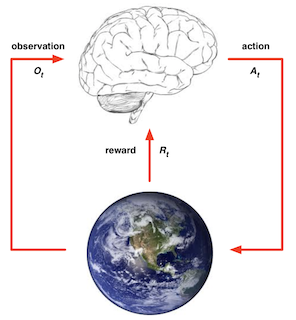

# Flappy Bird

* My English and Coding ability is limited. If there is any mistakes, please correct me.
I will try to make this project better.

## Overview
In this project, I try using Reinforcement Learning to play a game, called "FLAPPY BIRD".
[yenchenlin](https://github.com/yenchenlin) had provided a version and some idea.
BUT what I want to do is a little different (or say, I play it in a different way).
I make the pipe move **UP and DOWN** each frame. If I can play the game under this situation, 
I estimate that it play the origin game very well.

## Introduction
### Game
"Flappy Bird" is a side-scrolling game in which the gameplay action is viewed from a side-view camera angle, 
and the onscreen characters can generally only move to the left or right. It is just like "Super Mario Bros". 
In the game, there is a flying bird, named "Faby", who moves continuously towards the right. 
The objective is to direct Faby between sets of Mario-like pipes. If Faby hits the pipe, then player lose. 
Faby briefly flaps upward each time that the player click left mouse button; if the buttuon is not clicked, 
Faby falls because of gravity. Each pair of pipes that he navigates between earns the player one point.
Therefore, player should fly Faby as far as possible to get high score.

<div align="center"></div>

### Reinforcement Learning

#### Charactoristics of  Reinforcement Learning
- There is no supervisor, only a reward signal. 
- Feedback is delayed, not instantaneous. 
- Time really matters. 
- Agent’s actions affect the subsequent data it receives.
#### Reward
A reward Rt is a scalar feedback signal, which indicates how well agent is doing at step t.
The agent’s job is to maximise cumulative reward.
Reinforcement learning is based on the reward hypothesis.
#### Agent and Environment
Agent is just like a human, it makes decision from the current environment and result.
Then the action influences on environment, and the agent gets new environment and result. 
It learns these situations and gradually finds a good way to make decision and gets better result.

<div align="center"><div></div></div>

Interaction of **Agent** and **Environment**. At each step ***t***: 
The agent: executes action ***At***, receives observation ***Ot***, receives scalar reward ***Rt***.
The environment: receives action ***At***, emits observation ***Ot+1***, emits scalar reward ***Rt+1***.
***t*** increments at environment step.

#### Markov Decision Processes
##### Markov Property
A state **St** is Markov if and only if **P[St+1 | St] = P[St+1 | S1,...,St]**

It means that the future is independent of the past given the present.
##### Markov Process
A Markov process is a memoryless random process(a sequence of random states S1, S2, ... with the Markov property). 

A Markov Process (or Markov Chain) is a tuple <***S,P***>, ***S*** is a (finite) set of states, 
***P*** is a state transition probability matrix, ***Pss'*** = P[***St+1=s'*** | ***St=s***]

##### Markov Reward Process
Markov Reward Process is a tuple <***S, P, R, γ***>, ***S*** is a finite set of states,
***P*** is a state transition probability matrix, ***Pss'*** = P[***St+1=s'*** | ***St=s***],
***R*** is a reward function, ***Rs*** = E[***Rt+1*** | ***St = s***], ***γ*** is a discount factor, γ ∈ [0, 1].

##### Return
The return Gt is the total discounted reward from time-step t.
Gt =Rt+1+γRt+2+...=􏰋Sigma(k=0->∞)[γkRt+k+1]

## Reproduction
First, I'll reproduce what [yenchenlin/DeepLearningFlappyBird](https://github.com/yenchenlin/DeepLearningFlappyBird)
did in a clearer and more flexible structure(learn from [Morvan](https://morvanzhou.github.io/tutorials/machine-learning/reinforcement-learning/)). 
Of course, the main idea and methods are not changed. In this procedure, I fix some bugs, 
record the score per episode using TensorBoard, visualize how images(game screen) processed and make
it can run in the "dummy"(headless) mode(say, running without video devices).

## Result
#### Nature dqn
<div align="center">loss<div></div></div>
<div align="center">score<div></div></div>

#### Mydqn
<div align="center">loss<div></div></div>
<div align="center">score<div></div></div>

#### Mydqn2
<div align="center">loss<div></div></div>
<div align="center">score<div></div></div>

## How to Run?
```
git clone https://github.com/wenlisong/flappybird.git
cd flappybird
python main.py -g fb -n dqn
```


## Installation Dependencies:
* python 3.6
* tensorflow 1.8.0
* opencv-python
* pygame

